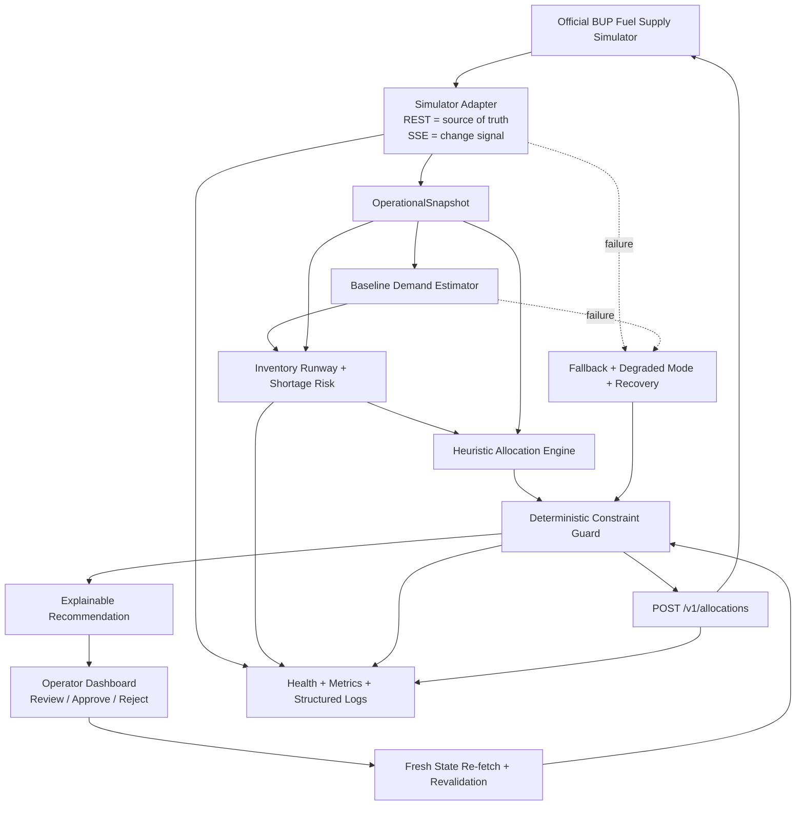

<!-- BUP_DOCS_START -->
# BUP FuelOps Resilience 2026

**Intelligent, explainable and resilient fuel-supply decision support for the BUP CSE Fest 2026 Hackathon Finals.**

The official BUP Fuel Supply Simulator is the operational world. This project is the decision-support brain that observes the simulator, estimates shortage risk, recommends feasible replenishment actions, keeps a human operator in control, and continues operating through domain crises and injected software/API failures.

## Version 1 Goal

Build the smallest complete, runnable and defensible operational loop first:

```text
Observe
→ Estimate Demand
→ Calculate Inventory Runway
→ Assess Shortage Risk
→ Generate Feasible Allocation
→ Explain Recommendation
→ Human Review
→ Fresh-State Revalidation
→ Execute
→ Monitor
→ Recover
```

## Documentation

- [Problem & V1 Solution Approach](docs/PROBLEM_AND_SOLUTION.md)
- [System Architecture](docs/ARCHITECTURE.md)
- [V1 Execution & Test Plan](docs/V1_EXECUTION_PLAN.md)
- [Team Parallelization Contracts](docs/TEAM_PARALLELIZATION.md)

## Core Architecture



## Design Principle

> **Advanced intelligence must be replaceable; the core operational loop must remain functional.**

A better forecasting model or optimizer can be plugged in later through frozen contracts without rewriting the operator workflow or simulator integration.

## Repository

`MrNowYouSeeMe/bup-fuelops-resilience-2026`
<!-- BUP_DOCS_END -->
<!-- PHASE2-START -->
## Phase 2 — Prediction, Risk & Human-Governed Allocation

Phase 2 adds deterministic/statistical demand forecasting, stockout risk, constrained allocation recommendations, operator Approve/Reject, fresh-state revalidation and idempotent simulator execution.

Run the current judge demo:

```powershell
powershell.exe -NoLogo -NoProfile -ExecutionPolicy Bypass `
-File "E:\bup-fuelops-resilience-2026\scripts\RUN_PHASE2.ps1"
```

- Frontend: `http://127.0.0.1:5173`
- Backend API docs: `http://127.0.0.1:8001/docs`
- Decision support: `http://127.0.0.1:8001/api/decision-support`
- Simulator admin: `http://127.0.0.1:8000/admin`

Detailed design: `docs/PHASE2_INTELLIGENCE_AND_DECISION.md`.
<!-- PHASE2-END -->
