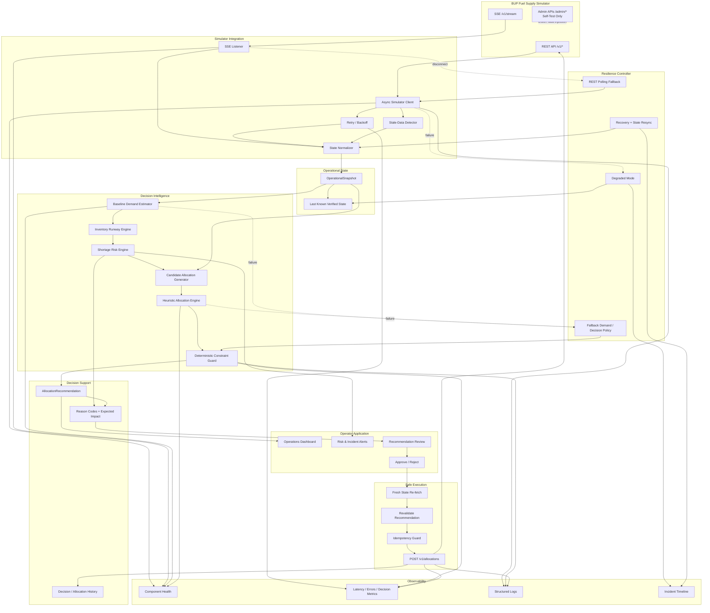
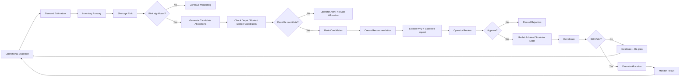
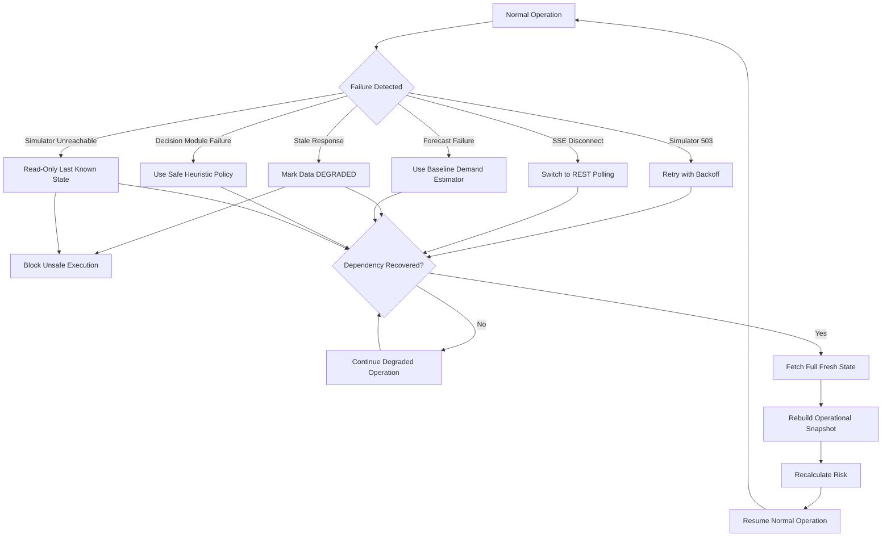
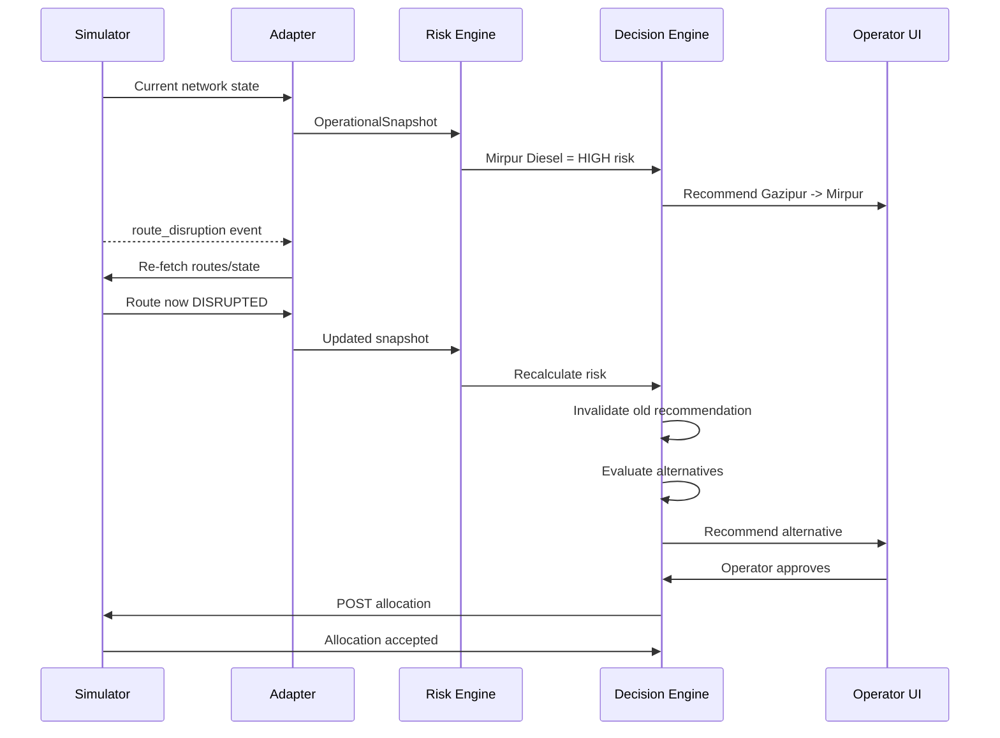
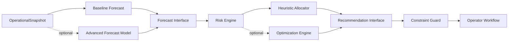

# Version 1 System Architecture

## Main Architecture



## Core Decision Pipeline



## Failure and Recovery



## Crisis Adaptation Example



## Replaceable Intelligence



## Frozen Contracts

### ForecastResult

```text
forecast(snapshot) -> ForecastResult[]
```

Fields:
- station_id
- fuel_type
- horizon_ticks
- predicted_demand_liters
- demand_per_tick
- confidence
- method

### RiskAssessment

Fields:
- station_id
- fuel_type
- risk_level
- runway_ticks
- projected_stockout_tick
- confidence
- reason_codes

### AllocationRecommendation

Fields:
- recommendation_id
- source_depot_id
- destination_station_id
- route_id
- fuel_type
- quantity
- priority
- confidence
- risk_before
- risk_after
- constraints_checked
- reason_codes
- alternatives
